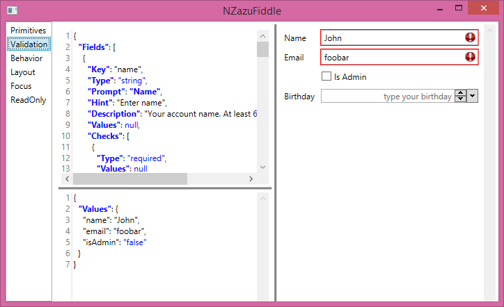

# Introduction

**NZazu** is a WPF form templating engine which renders a form based on an abstract form definition. 

 

 
 

# NZazuFiddle 

The sample application **NZazuFiddle** can be used for designing forms in real-time

# NZazuView

The main view **NZazuView** connects factories, strategies and serializer to be flexible and extensible.

## FormDefinition

A **FormDefinition** defines a form with field types, descriptive texts and prompts. The definition is 
independent from the kind of data storage (e.g. object, dictionary) or rendering (e.g. wpf controls from 
[Xceeds Extended WPF Toolkit](http://wpftoolkit.codeplex.com/))

    FormDefinition = new FormDefinition
    {
        Fields = new[]
        {
            new FieldDefinition
            {
                Key = "settings", 
                Type = "label",
                Prompt = "Settings",
                Description = "You can manage your account here."
            },
            new FieldDefinition
            {
                Key = "name", 
                Type = "string",
                Prompt = "Name",
                Hint = "Enter name",
                Description = "Your account name. Only alpha-numeric ..."
            },
            new FieldDefinition
            {
                Key = "isAdmin", 
                Type = "bool",
                //Prompt = "Is Admin",
                Hint = "Is Admin",
                Description = "Check to grant administrator permissions"
            }
        }
    }

# INZazuWpfFieldFactory

The field factory created the fields depending on several strategies and its own implementation of `CreateField()` to create and compose fields.

The factory suports `INZazuWpfFieldBehaviorFactory`, `ICheckFactory` and `INZazuDataSerializer` strategy factories to support custom behavior, serialization and checks. Details see below.

## INZazuFieldFactory

The field factory creates fields (controls) based on a template definition. By default, the following 
factories are implemented.

- [x] NZazuFieldFactory (main package)
- [x] XceedFieldFactory (xceed package)

## INZazuLayoutStrategy

The layout strategy provides the mechanism to render the generated fields into the **NZazuView**

- [x] GridLayoutStrategy (main package)
- [x] StackedLayoutStrategy (main package)

## INZazuDataSerializer

The data serializer is used for e.g. data table to serialize a big amount of data. Currentyl the following strategies are implemented

- [x] NZazuXmlSerializer (main package)
- [x] NZazuJsonSerializer (json serializer package)

# Default Extender

Basic custom behavior and checks can be implemented using the interface for behaviors `INZazuWpfFieldBehavior` and checks `IValueCheck`.

## Custom Field Behavior

Implement the interface `INZazuWpfFieldBehavior` and register the implementation at the behavior extender.

    BehaviorExtender.Register<OpenUrlOnStringEnterBehavior>("OpenUrlOnStringEnter");

# Custom Checks

Implement the interface `IValueCheck` and implement an `ICheckFactory` (which should overwrite the existing implementation).

# Contribs

## Icons	

Some icons are taken from http://www.iconarchive.com/show/oxygen-icons-by-oxygen-icons.org/Actions-go-jump-today-icon.html
