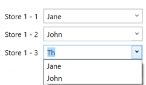

# Label `label`

# Checkbox `bool`

# Integer field `int`

# Single Line Text `string`

# Date and Time field `date`

# Floating Number `double`

# Option field `option`

# Keyed Option Field `keyedoption`

The keyed option field is a field which syncs the entered values to the available option of each other field.

Usage:

	{
	  "Fields": [
	    {
	      "Key": "storekey0101",
	      "Type": "keyedoption",
	      "Prompt": "Store 1 - 1",
	      "Settings": {
	        "storekey": "store1"
	      }
	    },
	    {
	      "Key": "storekey0102",
	      "Type": "keyedoption",
	      "Prompt": "Store 1 - 2",
	      "Settings": {
	        "storekey": "store1"
	      }
	    },
	    {
	      "Key": "storekey0103",
	      "Type": "keyedoption",
	      "Prompt": "Store 1 - 3",
	      "Settings": {
	        "storekey": "store1"
	      }
	    }
	  ]
	}

It is important to use the `storekey` setting to use different groups of combo boxes.

